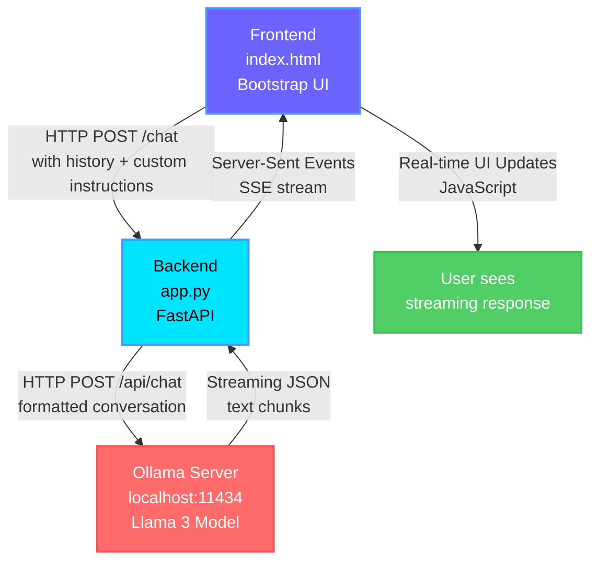
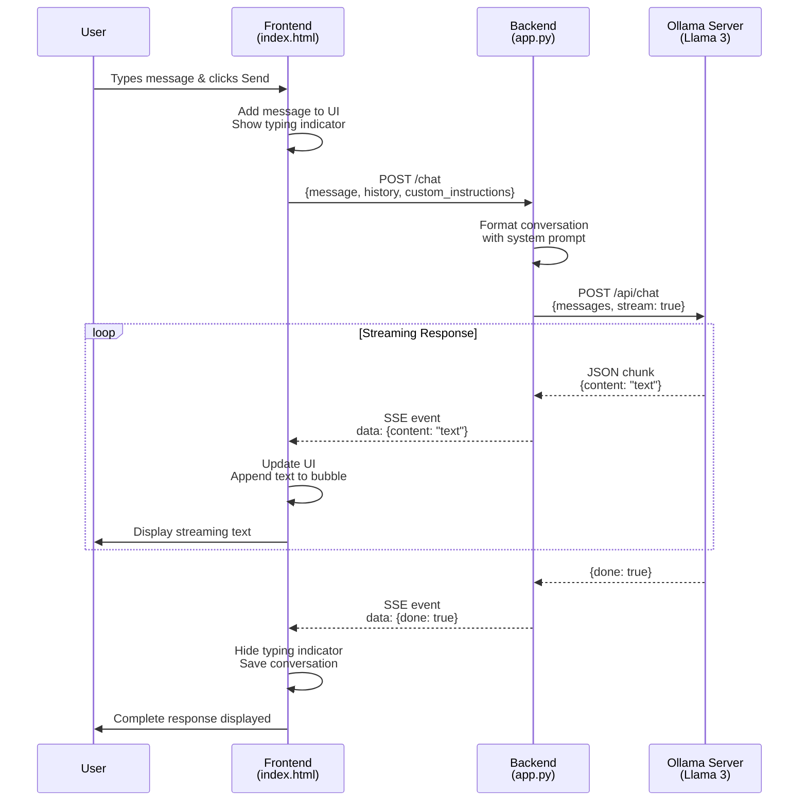
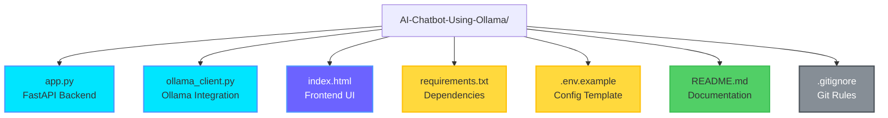

# 💬 Mike - AI Chatbot Using Ollama

<div align="center">


**A fully functional, elegant AI chatbot application powered by Ollama and Llama 3, featuring a beautiful ChatGPT-style interface with conversation history, personalization, and real-time streaming responses.**

[Features](#-features) • [Installation](#-installation) • [Usage](#-usage) • [Screenshots](#-screenshots) • [Architecture](#-architecture) • [Contributing](#-contributing)

</div>

---

## ✨ Features

### 🤖 Core Functionality
- **Local AI Processing**: Uses Ollama with Llama 3 model running entirely on your machine
- **Real-time Streaming**: Responses stream in real-time with a natural typing effect
- **Multi-turn Conversations**: Maintains full conversation context across messages
- **Conversation History**: Save, load, and manage multiple conversations (ChatGPT-style sidebar)
- **Custom Instructions**: Personalize how Mike responds to your messages

### 🎨 User Interface
- **Elegant Design**: Modern, professional UI with smooth animations and gradients
- **ChatGPT-style Sidebar**: 
  - 📜 **History Tab**: View and manage all your conversations
  - ⚙️ **Settings Tab**: Set custom instructions for personalized responses
- **Smart Suggestions**: Interactive suggestion chips appear only at conversation start
- **Smooth Scrolling**: Auto-scroll with scroll-to-top/bottom buttons
- **Responsive Design**: Works seamlessly on desktop, tablet, and mobile devices
- **Dark Theme**: Beautiful gradient backgrounds with elegant color palette

### 🔧 Technical Features
- **Server-Sent Events (SSE)**: Real-time streaming responses
- **Error Handling**: Comprehensive error handling with user-friendly messages
- **Connection Testing**: Automatic backend and Ollama connectivity checks
- **Persistent Storage**: Conversations and settings saved in browser localStorage
- **Configurable**: Easy configuration via environment variables

---

## 📋 Prerequisites

Before you begin, ensure you have the following installed:

1. **Python 3.8+** - [Download Python](https://www.python.org/downloads/)
2. **Ollama** - [Download Ollama](https://ollama.ai/)
3. **Git** (for cloning) - [Download Git](https://git-scm.com/downloads)

---

## 🚀 Installation

### Step 1: Clone the Repository

```bash
git clone https://github.com/SairajJadhav08/AI-Chatbot-Using-Ollama.git
cd AI-Chatbot-Using-Ollama
```

### Step 2: Install Ollama

1. Download and install Ollama from [https://ollama.ai/](https://ollama.ai/)
2. Verify installation:
   ```bash
   ollama --version
   ```

### Step 3: Start Ollama Server

Open a terminal and start the Ollama server:

```bash
ollama serve
```

**Keep this terminal open!** The server runs on `http://localhost:11434` by default.

### Step 4: Download Llama 3 Model

In a **new terminal window**, download the Llama 3 model:

```bash
ollama pull llama3
```

Or run it directly (will download if not present):

```bash
ollama run llama3
```

**Note**: First download may take several minutes (~4.7GB). You can exit the interactive session with `/bye` or `Ctrl+C`.

### Step 5: Install Python Dependencies

```bash
pip install -r requirements.txt
```

**Note**: On some systems, use `pip3` instead of `pip`.

### Step 6: Configure Environment Variables (Optional)

Create a `.env` file:

```bash
# Windows (PowerShell)
Copy-Item .env.example .env

# Linux/Mac
cp .env.example .env
```

Edit `.env` to customize:
```env
OLLAMA_URL=http://localhost:11434
OLLAMA_MODEL=llama3
PORT=8000
```

---

## 💻 Usage

### Starting the Application

#### 1. Start the Backend Server

Open a terminal in the project directory:

```bash
python app.py
```

You should see:
```
INFO:     Started server process
INFO:     Uvicorn running on http://0.0.0.0:8000
```

**Keep this terminal open!**

#### 2. Open the Frontend

Open `index.html` in your web browser:
- **Double-click** `index.html` in file explorer, OR
- **Right-click** → "Open with" → Choose your browser, OR
- **Drag and drop** `index.html` into your browser

#### 3. Start Chatting! 💬

1. Type a message in the input field
2. Click **Send** or press **Enter**
3. Watch Mike respond in real-time! ✨

### Using the Sidebar

#### 📜 History Tab
- **New Conversation**: Click "➕ New Conversation" to start fresh
- **Load Conversation**: Click any conversation in the list to continue
- **Delete Conversation**: Click 🗑️ icon on any conversation

#### ⚙️ Settings Tab
- **Custom Instructions**: Tell Mike how you want him to respond
  - Example: "Use a friendly and casual tone"
  - Example: "Always provide examples"
- **Save Settings**: Click "💾 Save Settings" to apply

### Suggestion Chips

At the start of a conversation, you'll see interactive suggestion chips:
- 😄 **Tell me a joke**
- 📅 **Plan my day**
- 💡 **Explain something**
- ✍️ **Write a story**

Click any chip to instantly send that message!

---

## 📸 Screenshots

### Main Interface


**Features shown:**
- ✨ Elegant gradient header with "Mike - AI Assistant"
- 💬 Clean chat bubbles (user messages on right, assistant on left)
- 🎨 Smooth animations and hover effects
- 📜 ChatGPT-style sidebar with History and Settings tabs
- 🔘 Interactive suggestion chips at conversation start
- 📱 Fully responsive design

### Sidebar Features

**History Panel:**
- View all your conversations organized by date
- Quick access to previous chats
- Delete conversations with one click

**Settings Panel:**
- Customize Mike's personality and response style
- Set custom instructions for personalized interactions
- Settings persist across sessions

### Responsive Design
- Works beautifully on all screen sizes
- Mobile-friendly touch interactions
- Adaptive layout for tablets and phones

---

## 🏗️ Architecture

### System Overview



### Detailed Component Flow



### Project Structure



### Key Components

#### Frontend (`index.html`)
- **Bootstrap 5.3**: Modern, responsive UI framework
- **JavaScript**: Handles API communication and UI updates
- **localStorage**: Persists conversations and settings
- **SSE Parsing**: Processes streaming responses in real-time
- **Error Handling**: User-friendly error messages

#### Backend (`app.py`)
- **FastAPI**: Modern Python web framework
- **CORS Middleware**: Allows frontend-backend communication
- **StreamingResponse**: Sends SSE-formatted chunks
- **Error Handling**: Graceful error management

#### Ollama Client (`ollama_client.py`)
- **HTTP Client**: Communicates with Ollama via `httpx`
- **History Formatting**: Structures conversation with system prompt
- **Streaming**: Processes Ollama's streaming responses
- **Custom Instructions**: Integrates user preferences into system prompt

---

## 🔧 Configuration

### Environment Variables

Create a `.env` file (see `.env.example`):

| Variable | Default | Description |
|----------|---------|-------------|
| `OLLAMA_URL` | `http://localhost:11434` | Ollama server address |
| `OLLAMA_MODEL` | `llama3` | Model name to use |
| `PORT` | `8000` | Backend server port |

### Frontend Configuration

Edit `index.html` (around line 960):

```javascript
const API_URL = 'http://localhost:8000';  // Change if backend on different port
```

---

## 🐛 Troubleshooting

### ❌ "Ollama server is not running"

**Solution**:
1. Open a terminal
2. Run: `ollama serve`
3. Keep the terminal open
4. Refresh the browser

### ❌ "Model llama3 not available"

**Solution**:
```bash
ollama pull llama3
```

Verify with:
```bash
ollama list
```

### ❌ Backend won't start

**Solution**:
- Check if port 8000 is in use
- Change `PORT` in `.env` to a different port (e.g., 8001)
- Update `API_URL` in `index.html` to match

### ❌ Frontend can't connect to backend

**Solution**:
1. Ensure backend is running: `python app.py`
2. Check browser console (F12 → Console tab)
3. Verify `API_URL` in `index.html` matches backend URL
4. Make sure you're opening `index.html` directly (not through a web server)

### ❌ Responses are slow

**Solution**:
- This is normal for local LLM inference
- Llama 3 requires significant resources (8GB+ RAM recommended)
- Close other resource-intensive applications
- Consider using a smaller model if available

### ❌ CORS errors

**Solution**:
- Backend includes CORS middleware
- Ensure backend is running
- Open `index.html` via `file://` protocol (not through a web server)

---

## 🎯 Advanced Usage

### Using a Different Model

1. Download the model:
   ```bash
   ollama pull llama3
   ```

2. Update `.env`:
   ```env
   OLLAMA_MODEL=llama3
   ```

3. Restart backend server

### Remote Ollama Server

If Ollama runs on a different machine:

1. Update `.env`:
   ```env
   OLLAMA_URL=http://<remote-ip>:11434
   ```

2. Ensure Ollama allows remote connections

### Custom System Prompt

Edit `ollama_client.py` (around line 20):

```python
self.system_prompt = "Your custom prompt here..."
```

---

## 📚 API Reference

### POST `/chat`

Send a message to the chatbot.

**Request Body**:
```json
{
  "message": "Hello, Mike!",
  "history": [
    {"role": "user", "content": "Previous message"},
    {"role": "assistant", "content": "Previous response"}
  ],
  "custom_instructions": "Use a friendly tone"
}
```

**Response**: Server-Sent Events (SSE) stream

**Example**:
```javascript
fetch('http://localhost:8000/chat', {
  method: 'POST',
  headers: {'Content-Type': 'application/json'},
  body: JSON.stringify({
    message: 'Hello!',
    history: [],
    custom_instructions: null
  })
})
```

### GET `/`

Health check endpoint.

**Response**:
```json
{
  "status": "ok",
  "message": "AI Chatbot API is running"
}
```

---

## 🤝 Contributing

Contributions are welcome! Please feel free to submit a Pull Request.

1. Fork the repository
2. Create your feature branch (`git checkout -b feature/AmazingFeature`)
3. Commit your changes (`git commit -m 'Add some AmazingFeature'`)
4. Push to the branch (`git push origin feature/AmazingFeature`)
5. Open a Pull Request

---

## 📝 License

This project is licensed under the MIT License - see the [LICENSE](LICENSE) file for details.

---

## 🙏 Acknowledgments

- [Ollama](https://ollama.ai/) - For the amazing local LLM framework
- [FastAPI](https://fastapi.tiangolo.com/) - For the modern Python web framework
- [Bootstrap](https://getbootstrap.com/) - For the beautiful UI components
- [Llama 3](https://llama.meta.com/) - For the powerful language model

---

## 📞 Support

For issues related to:
- **Ollama**: Visit [Ollama GitHub](https://github.com/ollama/ollama)
- **FastAPI**: Visit [FastAPI Documentation](https://fastapi.tiangolo.com/)
- **This Project**: Open an issue on [GitHub Issues](https://github.com/SairajJadhav08/AI-Chatbot-Using-Ollama/issues)

---

<div align="center">

**Made with ❤️ by [Sairaj Jadhav](https://github.com/SairajJadhav08)**

⭐ **Star this repo if you find it helpful!**

</div>
